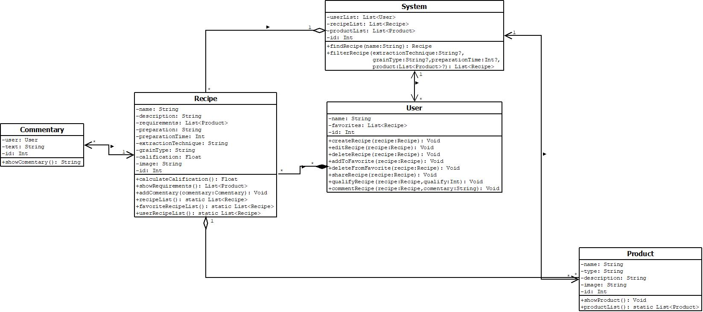

# MyCoffe

## Descripción

MyCoffee es mi nueva aplicación móvil creada para los amantes del café, permitiéndote explorar, personalizar y compartir recetas de café a tu gusto. 
¿Quieres perfeccionar tus técnicas o probar algo nuevo? 
MyCoffee te acompaña con guías predefinidas y recetas personalizadas, brindándote todo lo necesario para que cada taza sea perfecta.
Nuestra interfaz amigable y atractiva, diseñada especialmente para los fanáticos del café, te permitirá disfrutar de una agradable experiencia visual, con imágenes e íconos representativos para cada receta. 
MyCoffee: Tu pasión por el café, en tu propio bolsillo.

## Requerimientos

### Requerimientos funcionales

1. MyCoffe debe permitir a los usuarios ver, crear, editar y eliminar recetas de café.
2. MyCoffe debe permitir a los usuarios personalizar(guardar, eliminar) una lista de recetas favoritas.
3. MyCoffe debe permitir a los usuarios seguir guías predefinidas para distintos tipos de café.
4. MyCoffe debe permitir a los usuarios filtrar distintas recetas de café según sus preferencias(tecnica de extracción,
   tiempo de preparación, ingredientes, tipo de grano, equipo necesario,etc).
5. MyCoffe debe permitir a los usuarios compartir sus recetas y/o experiencias de preparación de café.
6. MyCoffe debe permitir a los usuarios calificar recetas y/o experiencias de preparación de café.
7. MyCoffe debe permitir a los usuarios ver los productos necesarios para una correcta preparación de la receta de café.

### Requerimientos no funcionales

1. MyCoffe debe presentar una interfaz intuitiva y amigable para una optimizada experiencia dentro de esta.
2. MyCoffe debe presentar imagenes relacionadas a los productos necesarios para cada tipo de café.
3. MyCoffe debe seguir una gama de colores atractiva y acorde a la temática de recetas de café.
4. MyCoffe debe presentar iconos acordes y de fácil identificación.

## Diagrama de clases

## Enlaces videos

[Video presentación](https://drive.google.com/file/d/1N9043VJ-9QV7QKd6fKoG5D9J3KNlbRmq/view?usp=sharing)
[Video uso en emulador android](https://drive.google.com/file/d/1REG61jnd98l03gh9Y_LQmFl6z4hMyqJG/view?usp=sharing)