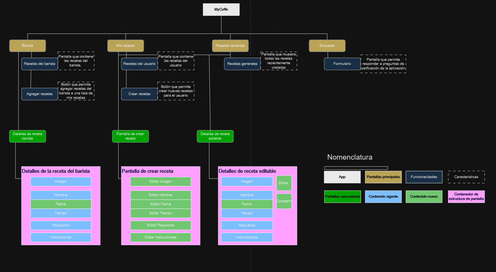
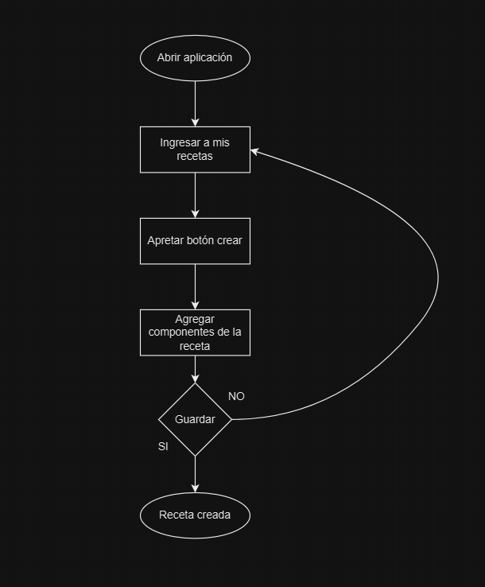

# MyCoffee

## Descripción
MyCoffee es una aplicación móvil desarrollada en Flutter que permite a los usuarios gestionar y personalizar sus propias recetas de café. Esta misma te ofrece funcionalidades para explorar recetas de un barista, crear y almacenar recetas personalizadas, y registrar detalles clave de cada receta, como el nombre, la imagen, los requisitos, el tiempo de preparación y las instrucciones.

Además de gestionar recetas, la app incluye una sección de recetas recientes que permite a los usuarios acceder fácilmente a las recetas recientes. La interfaz es intuitiva y personalizable, con iconos y temas adaptados a la temática de la aplicación. También incluye un formulario de encuesta que recopila la experiencia del usuario con la app, y envía esta información por correo electrónico al desarrollador para mejorar la experiencia y funcionalidad del proyecto.

## Requerimientos

### Requerimientos funcionales

1. MyCoffee debe permitir a los usuarios ver, crear, editar y eliminar recetas de café.
2. MyCoffee debe permitir a los usuarios personalizar(guardar, eliminar) recetas de café.
3. MyCoffee debe permitir a los usuarios ver un barista con recetas fijas.
4. MyCoffee debe permitir a los usuarios agregar recetas del barista y verlas en sus recetas.
5. MyCoffee debe permitir a los usuarios ver sus recetas recientes.
6. MyCoffee debe permitir a los usuarios compartir recetas.
7. MyCoffee debe permitir a los usuarios completar y compartir una encuesta sobre sus opinión de la aplicación.
8. MyCoffe debe permitir a los usuarios usar la cámara para agregar fotos a las recetas.

### Requerimientos no funcionales

1. MyCoffee debe presentar una interfaz amigable y una paleta de colores reconocible.
2. MyCoffee debe presentar imagenes relacionadas a las recetas.
3. MyCoffee debe presentar un icono de aplicación propio.

## Diagramas

## Enlaces videos

[Video presentación](https://drive.google.com/file/d/1jg3xfmlLZ_ihHnbS2Bjwol3Uxeh8tftc/view?usp=sharing)
[Video uso de app por persona externa a la carrera](https://drive.google.com/file/d/1ApTf0V_jB4zAYu0M4qYfMBCoPJi1xDoI/view?usp=sharing)

